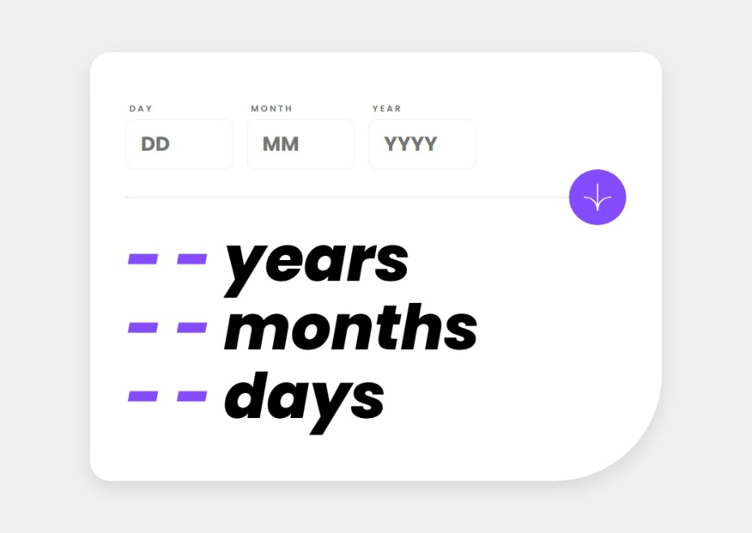

# Frontend Mentor - Age calculator app solution

This is a solution to the [Age calculator app challenge on Frontend Mentor](https://www.frontendmentor.io/challenges/age-calculator-app-dF9DFFpj-Q). Frontend Mentor challenges help you improve your coding skills by building realistic projects.

  
  
  
  

## Table of contents

- [Overview](#overview)
  - [The challenge](#the-challenge)
  - [Screenshot](#screenshot)
  - [Links](#links)
- [Author](#author)

## Overview

### The challenge

#### To develop....

Users should be able to:

- [X] View an age in years, months, and days after submitting a valid date through the form
- [ ] Receive validation errors if:
  - [X] Any field is empty when the form is submitted
  - [X] The day number is not between 1-31
  - [X] The month number is not between 1-12
  - [X] The date is in the future
  - [ ] The date is invalid e.g. 31/04/1991 (there are 30 days in April)
- [X] View the optimal layout for the interface depending on their device's screen size
- [X] See hover and focus states for all interactive elements on the page
- [ ] **Bonus**: See the age numbers animate to their final number when the form is submitted

### Screenshot

### Links

- Solution URL: [Add solution URL here](https://your-solution-url.com)
- Live Site URL: [GitPages](https://maluwhoo.github.io/age-calculator-app/)

## Author

- Website - [GitHub](https://github.com/MaluWhoo)
- Frontend Mentor - [@MaluWhoo](https://www.frontendmentor.io/profile/MaluWhoo)